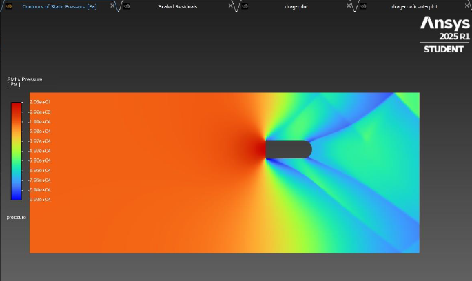
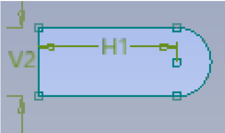
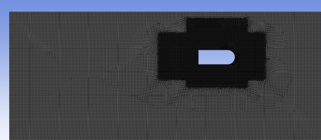
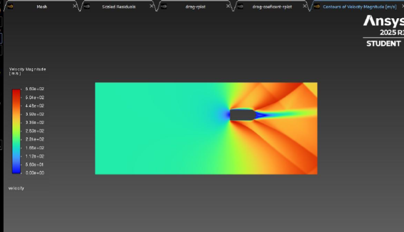

# Supersonic Flow Analysis of a Bullet

## Overview
This project is part of my Mechanical Engineering studies at Çukurova University, analyzing supersonic flow over a bullet to compute drag coefficient (Cd) and drag forces. It combines computational fluid dynamics (CFD) simulations using ANSYS Fluent with analytical calculations in MATLAB, validating theoretical models against industry-standard numerical results. The project was conducted in 2025 to study shock wave formation and aerodynamic performance at Mach 1.5 and Mach 2.

## Objective
To model supersonic flow around a bullet, calculate Cd and drag forces using MATLAB, and validate these with Fluent CFD simulations, comparing analytical and numerical approaches for accuracy.

## Methodology
- **Geometry**: 2D bullet model (8 mm length, 2 mm diameter) due to ANSYS Student version limitations.
- **CFD Simulations**:
  - Software: ANSYS Fluent with k-epsilon turbulence model.
  - Conditions: Mach 1.5 and Mach 2, ideal gas model, steady-state solver.
  - Mesh: Quad-dominant meshes (50k, 100k, 300k elements) for convergence study.
  - Outputs: Pressure, velocity, Mach number contours; drag force and Cd.
- **Analytical Calculations**: MATLAB code to compute Cd using oblique shock relations, Prandtl-Meyer expansion, and modified Newtonian theory.
- **Tools**: CAD for geometry, ANSYS Fluent for CFD, MATLAB for post-processing and validation.

## Key Features
- **Bullet Geometry**:  
    
  *2D bullet model used in simulations.*
- **Mesh Diagram**:  
    
  *100k quad-dominant mesh for balanced accuracy and computational cost.*
- **Pressure Contour (Mach 1.5)**:  
    
  *Shock wave formation at Mach 1.5, 100k mesh.*
- **Velocity Contour (Mach 2)**:  
    
  *Flow behavior at Mach 2, 100k mesh.*

## Results
- **CFD Findings**:
  - Mach 1.5: Cd ≈ 0.42, drag force ≈ 270 N (300k mesh).
  - Mach 2: Cd ≈ 0.46, drag force ≈ 310 N (300k mesh).
  - Higher mesh density improves accuracy, but 100k mesh balances cost and precision.
- **MATLAB vs. CFD**:
  - Mach 1.5: MATLAB (Cd = 0.4167, drag = 265.98 N) closely matches CFD (Cd = 0.42, drag = 270 N).
  - Mach 2: MATLAB (Cd = 0.30, drag = 340.45 N) deviates from CFD (Cd = 0.46, drag = 310 N), indicating limitations in analytical assumptions.
- **Conclusion**: MATLAB is reliable for lower Mach numbers; higher Mach requires refined models or denser meshes.

## Code
- [code/mach_number_1.5_calculation.m](code/mach_number_1.5_calculation.m): MATLAB script for computing drag coefficient and drag force at Mach 1.5.
- [code/mach_number_2_calculation.m](code/mach_number_2_calculation.m): MATLAB script for computing drag coefficient and drag force at Mach 2.

## Report
- [Full Report](docs/bullet_analysis_1.pdf)  
  *Detailed methodology, results, and comparisons.*

